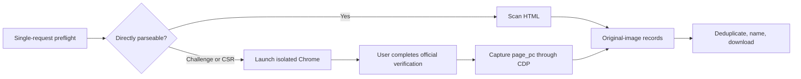

# Tieba Image Downloader

English | [简体中文](README.md)

[Website](https://xieweikai.github.io/tieba-image-downloader/) · [Latest release](https://github.com/XieWeikai/tieba-image-downloader/releases/latest) · [AI plugin](docs/plugin.en.md)

A high-performance macOS utility for batch-downloading original images from Baidu Tieba post bodies. It supports Tieba's client-rendered pages, opens an isolated Chrome window when login or security verification is required, captures paginated data automatically, and downloads images with resumability and validation.

> Download only content you are authorized to access and save. This program does not solve CAPTCHAs, bypass access controls, or inspect your personal Chrome profile.

## Features

- Download body images from all replies or from the original author only.
- Exclude avatars, emoticons, and decorative page assets.
- Support both legacy HTML and current Vue client-rendered pages.
- Use an isolated Chrome session without DevTools or manual cookie copying.
- Import only `baidu.com` cookies and optionally store them in macOS Keychain.
- Stable ordering, URL deduplication, deterministic names, and a JSON manifest.
- Streaming downloads, `.part` resume, per-item retries, and safe Ctrl+C handling.
- Adaptive concurrency with backoff and cooldown on HTTP 403/429.
- Validate status, `Content-Type`, and Range responses to reject HTML error pages.
- Expose a stable JSON result contract for scripts, ChatGPT/Codex, and Claude Code.

## Requirements

- macOS 12 or newer.
- Google Chrome, Chromium, or Brave for client rendering and official verification when required.
- Rust stable and Cargo when building from source.

## Installation

### AI plugin (recommended)

After installing the plugin, give ChatGPT/Codex or Claude Code a Tieba URL directly; no manual CLI invocation is required. On first use, the skill downloads the matching macOS release and verifies it against `SHA256SUMS` before execution.

Claude Code:

```text
/plugin marketplace add XieWeikai/tieba-image-downloader
/plugin install tieba-image-downloader@tieba-tools
```

Then ask it to "download every original image from `https://tieba.baidu.com/p/10918721568`", or invoke `/tieba-image-downloader:download-tieba-images` explicitly. See [Plugin Design and Usage](docs/plugin.en.md) for ChatGPT/Codex and local development installation.

### CLI

Download the binary from GitHub Releases, make it executable, and run it:

```bash
chmod +x tieba-image-downloader
./tieba-image-downloader
```

Build from source:

```bash
git clone https://github.com/XieWeikai/tieba-image-downloader.git
cd tieba-image-downloader
./install-macos.sh
```

The binary is written to `target/release/tieba-image-downloader`.

## Usage

Run without arguments for the interactive wizard:

```bash
tieba-image-downloader
```

Download a post directly:

```bash
tieba-image-downloader 'https://tieba.baidu.com/p/10918721568'
```

Common examples:

```bash
tieba-image-downloader URL --output ~/Downloads/my-thread
tieba-image-downloader URL --only-author
tieba-image-downloader URL --concurrency 8
tieba-image-downloader URL --concurrency 8 --auto-concurrency false
tieba-image-downloader URL --remember-login false
tieba-image-downloader URL --clear-login
tieba-image-downloader URL --chrome-path '/Applications/Chromium.app/Contents/MacOS/Chromium'
tieba-image-downloader URL --output-format json
tieba-image-downloader URL --metadata-only --output-format json
```

The default output directory is `~/Downloads/tieba_<post ID>`. Run `tieba-image-downloader --help` for every option.

## Browser Login

When the first request is challenged or requires client rendering, the program opens a visible Chrome instance with a dedicated profile. Complete any login or verification on Baidu's official page; the program resumes automatically. By default, the resulting session is reused through macOS Keychain.



Advanced users may still import a raw Cookie header or Netscape `cookies.txt` with `--cookie-file`. Treat cookies as credentials: never commit, paste, or share them.

## Output and Resume

```text
manifest.json         Order, floor, author, URL, and target filename
download-state.json   Per-item status, byte count, error, and timestamp
failed.json           Items that failed in the current run
*.part                Incomplete resumable data
00001_f0001_hash.jpg  Completed image
```

Run again with the same output directory to resume. A 206 response is appended only after validating `Content-Range`; a 200 response restarts the file; a 416 response is accepted only when the server's total equals the local size.

On success, `--output-format json` writes exactly one JSON object to stdout. It contains the post ID, absolute output directory, discovered/completed/skipped/failed counts, and whether browser verification was used. See [Structured Output](docs/structured-output.en.md) for the contract.

## Development

```bash
cargo fmt --all --check
cargo check --all-targets
cargo clippy --all-targets --all-features -- -D warnings
cargo test --all-targets
cargo build --release
./scripts/check-version-sync.sh
```

## Documentation

- [系统架构](docs/architecture.md) / [Architecture](docs/architecture.en.md)
- [模块设计](docs/modules.md) / [Module Design](docs/modules.en.md)
- [贴吧页面结构](docs/tieba-page-structure.md) / [Tieba Page Structure](docs/tieba-page-structure.en.md)
- [测试报告](docs/test-report.md) / [Test Report](docs/test-report.en.md)
- [GitHub Workflows](docs/workflows.md) / [GitHub Workflows (English)](docs/workflows.en.md)
- [插件设计与使用](docs/plugin.md) / [Plugin Design and Usage](docs/plugin.en.md)
- [结构化输出](docs/structured-output.md) / [Structured Output](docs/structured-output.en.md)

## License

MIT License.
