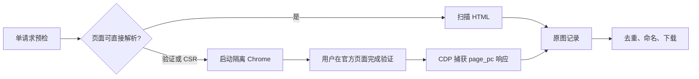

# Tieba Image Downloader

[English](README.en.md) | 简体中文

[官方网站](https://xieweikai.github.io/tieba-image-downloader/) · [最新版本](https://github.com/XieWeikai/tieba-image-downloader/releases/latest) · [AI 插件](docs/plugin.md)

一个面向 macOS 的高性能百度贴吧正文原图批量下载工具。它可以处理贴吧当前的客户端渲染页面，在需要登录或安全验证时打开独立 Chrome 窗口，自动捕获分页数据，并以可恢复、可校验的方式下载原图。

> 仅下载你有权访问和保存的内容。本程序不会破解验证码、绕过访问权限或读取个人 Chrome 配置。

## 功能

- 下载全帖或只看楼主的正文原图，排除头像、表情和页面装饰。
- 自动应对传统 HTML 与 Vue 客户端渲染页面。
- 遇到验证时启动隔离 Chrome；无需开发者工具或手工复制 Cookie。
- 仅提取隔离会话中的 `baidu.com` Cookie，并可保存到 macOS 钥匙串。
- 稳定排序、URL 去重、确定性文件名和 JSON manifest。
- 流式下载、`.part` 断点续传、独立重试和 Ctrl+C 安全停止。
- 自动调节下载并发；遇到 403/429 时降低并发并冷却。
- 校验 HTTP 状态、`Content-Type` 和 Range 响应，拒绝 HTML 错误页。
- 提供稳定的 JSON 结果契约，供脚本、ChatGPT/Codex 和 Claude Code 直接解析。

## 系统要求

- macOS 12 或更高版本。
- Google Chrome、Chromium 或 Brave，用于客户端渲染和必要的官方验证。
- 从源码构建需要 Rust stable 与 Cargo。

## 安装

### AI 插件（推荐）

安装插件后，直接在 ChatGPT/Codex 或 Claude Code 对话中提供贴吧链接即可，不需要手动运行 CLI。Skill 会在首次使用时下载对应的 macOS Release，并用 `SHA256SUMS` 校验后执行。

Claude Code：

```text
/plugin marketplace add XieWeikai/tieba-image-downloader
/plugin install tieba-image-downloader@tieba-tools
```

安装后可以直接说“下载 `https://tieba.baidu.com/p/10918721568` 的全部原图”，或显式调用 `/tieba-image-downloader:download-tieba-images`。Codex/ChatGPT 的安装方式及本地开发安装见[插件设计与使用](docs/plugin.md)。

### CLI

从 GitHub Release 下载对应二进制，赋予执行权限后运行：

```bash
chmod +x tieba-image-downloader
./tieba-image-downloader
```

从源码构建：

```bash
git clone https://github.com/XieWeikai/tieba-image-downloader.git
cd tieba-image-downloader
./install-macos.sh
```

生成的程序位于 `target/release/tieba-image-downloader`。

## 使用

不带参数会进入交互向导：

```bash
tieba-image-downloader
```

直接下载帖子：

```bash
tieba-image-downloader 'https://tieba.baidu.com/p/10918721568'
```

常用示例：

```bash
# 指定输出目录
tieba-image-downloader URL --output ~/Downloads/my-thread

# 只下载楼主图片
tieba-image-downloader URL --only-author

# 限制最大下载并发
tieba-image-downloader URL --concurrency 8

# 固定并发，不自动调节
tieba-image-downloader URL --concurrency 8 --auto-concurrency false

# 不将会话保存到钥匙串
tieba-image-downloader URL --remember-login false

# 清除钥匙串中的已保存会话
tieba-image-downloader URL --clear-login

# 使用指定 Chromium 浏览器
tieba-image-downloader URL --chrome-path '/Applications/Chromium.app/Contents/MacOS/Chromium'

# 机器可读结果；进度与验证提示仍显示在 stderr
tieba-image-downloader URL --output-format json

# 只生成图片元数据清单，不下载图片
tieba-image-downloader URL --metadata-only --output-format json
```

默认输出目录为 `~/Downloads/tieba_<帖子 ID>`。全部参数见：

```bash
tieba-image-downloader --help
```

## 浏览器登录流程

首次访问或百度要求验证时，程序会打开使用独立配置目录的可见 Chrome。请只在百度官方页面中正常登录或完成验证；之后程序自动继续。后续运行默认从 macOS 钥匙串复用会话。



高级用户仍可通过 `--cookie-file` 导入单行 Cookie 请求头或 Netscape `cookies.txt`。Cookie 等同登录凭据，不要提交到 Git、粘贴到聊天或分享。

## 输出与恢复

```text
manifest.json         图片顺序、楼层、作者、URL 与目标文件名
download-state.json   每项状态、字节数、错误和更新时间
failed.json           本轮最终失败项
*.part                尚未完成、可继续下载的数据
00001_f0001_hash.jpg  已完成图片
```

再次使用相同输出目录运行即可恢复。服务器返回 206 时校验 `Content-Range` 后追加；返回 200 时从头覆盖；416 仅在服务器声明的总长度等于本地大小时认定完成。

`--output-format json` 成功时在 stdout 输出唯一的 JSON 对象，字段包括帖子 ID、绝对输出目录、发现/完成/跳过/失败数量，以及是否使用浏览器验证。详细契约见[结构化输出](docs/structured-output.md)。

## 开发

```bash
cargo fmt --all --check
cargo check --all-targets
cargo clippy --all-targets --all-features -- -D warnings
cargo test --all-targets
cargo build --release
./scripts/check-version-sync.sh
```

## 文档

- [系统架构](docs/architecture.md) / [Architecture](docs/architecture.en.md)
- [模块设计](docs/modules.md) / [Module Design](docs/modules.en.md)
- [贴吧页面结构](docs/tieba-page-structure.md) / [Tieba Page Structure](docs/tieba-page-structure.en.md)
- [测试报告](docs/test-report.md) / [Test Report](docs/test-report.en.md)
- [GitHub Workflows](docs/workflows.md) / [GitHub Workflows (English)](docs/workflows.en.md)
- [插件设计与使用](docs/plugin.md) / [Plugin Design and Usage](docs/plugin.en.md)
- [结构化输出](docs/structured-output.md) / [Structured Output](docs/structured-output.en.md)

## 许可

MIT License。
