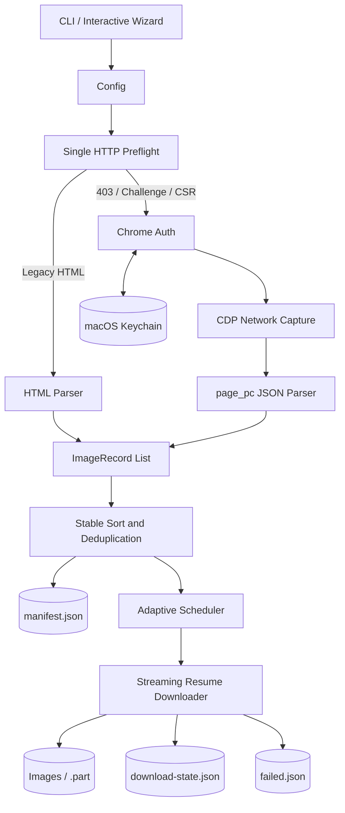
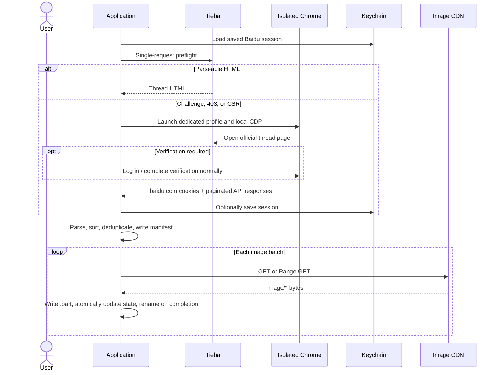
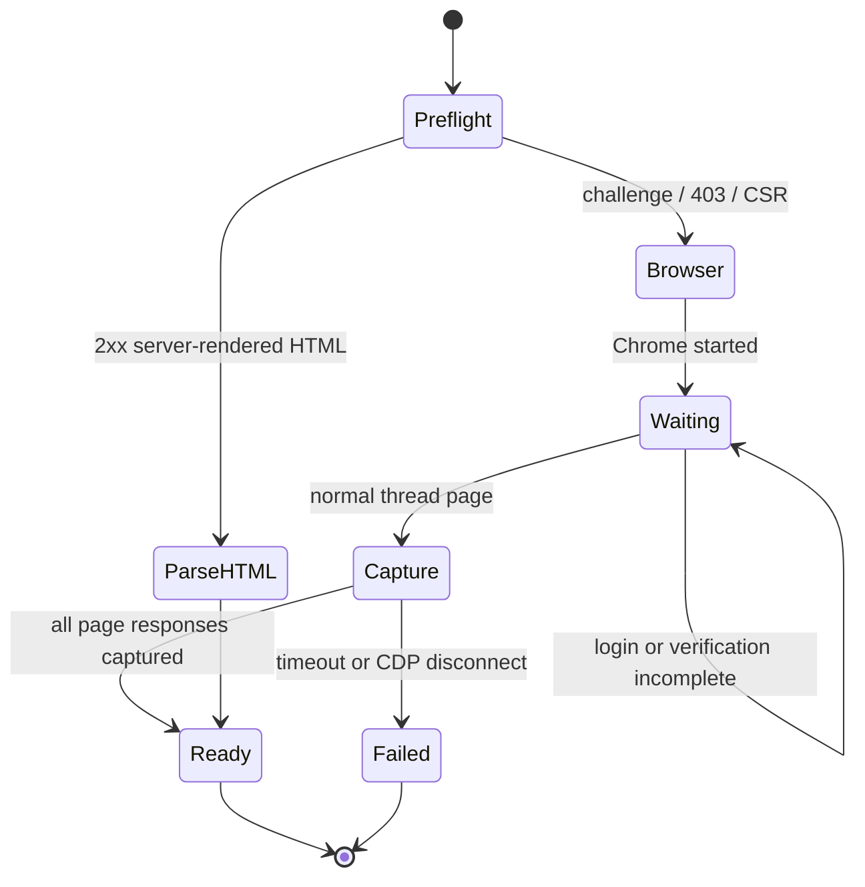
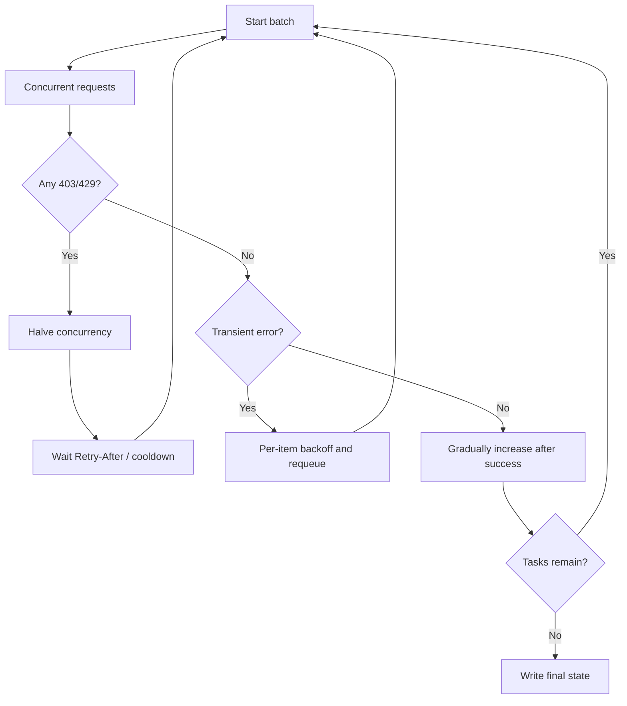

# System Architecture

English | [简体中文](architecture.md)

## Goals and Constraints

The system must extract every body image while Tieba's HTML and anti-abuse responses evolve, keep request pressure controlled, protect credentials, and resume large jobs after interruption. The architecture therefore separates access and authentication, content discovery, planning, and reliable downloading, with explicit data models between stages.

## High-Level Architecture

The dual parser keeps compatibility with legacy pages without depending on a virtualized DOM. A client-rendered page only mounts visible items, so scrolling the DOM can miss images. Capturing successful `page_pc` responses provides complete pagination without copying or reverse-engineering signed requests.

## Runtime Sequence

## Authentication State Machine

Chrome uses an application-owned profile and a random local debugging port. The program selects only `baidu.com` cookies and never opens the user's regular browser profile. CDP listens on `127.0.0.1`, and the dedicated browser is closed when capture finishes.

## Data Model and Boundaries

The central `ImageRecord` contains page, post order, image order, floor, author, post ID, source URL, normalized URL, and target filename. Parsers only produce records; deduplication only establishes order and names; the downloader only consumes records. A page-format change therefore stays out of resume logic, while a download-protocol change stays out of parsers.

State is updated atomically by writing, flushing, and renaming a temporary file. Images are written to same-directory `.part` files and renamed only after complete receipt, preventing a crash from presenting partial data as complete.

## Concurrency and Error Control

Page scanning and image downloading have independent limits. Downloads begin conservatively and grow after successful windows. HTTP 403/429 halves effective concurrency and honors `Retry-After` or the configured cooldown. DNS and connection failures use per-item exponential backoff without blocking completed work.

## Security Boundary

- No CAPTCHA solving, request bypass construction, or access-control bypass.
- No personal browser database access; only the application-owned Chrome profile is used.
- Cookies never enter logs, manifests, download state, or failure reports.
- Downloads require successful status and a recognized `image/*` MIME type.
- URLs, cookie files, concurrency values, and Range responses are validated before use.
