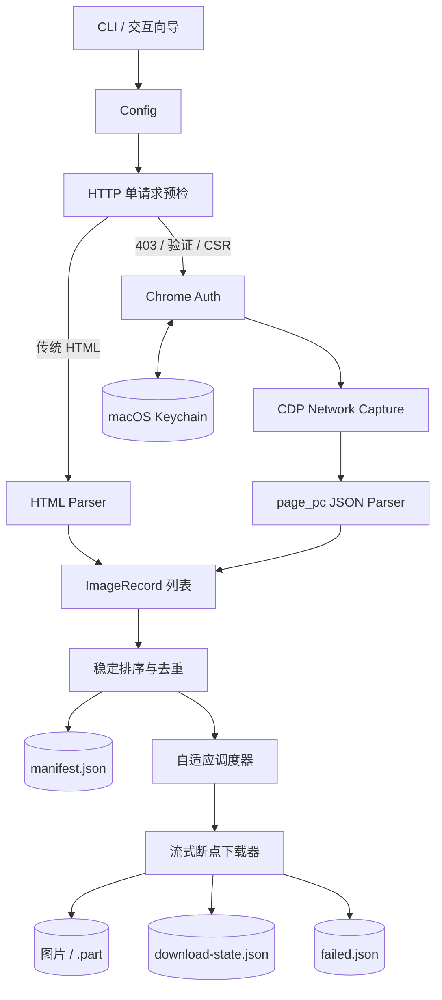
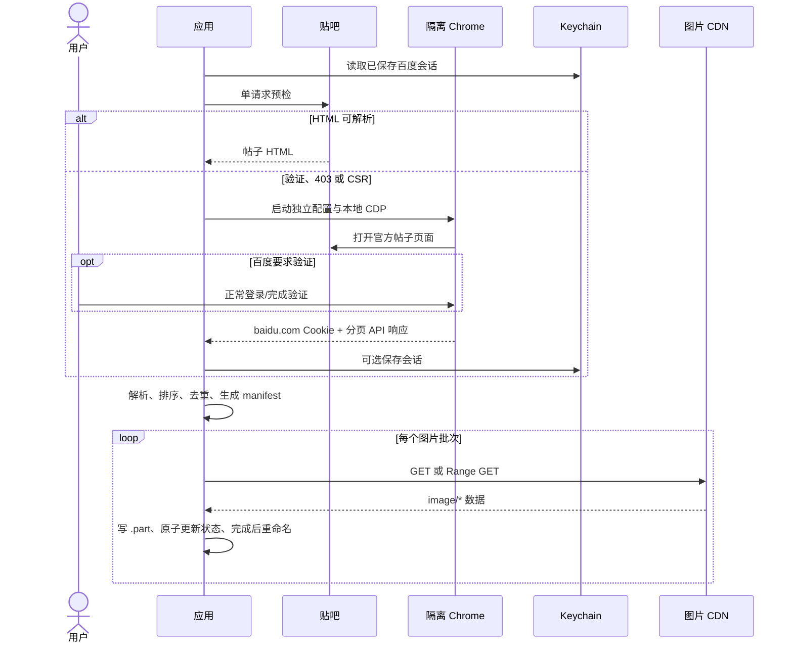
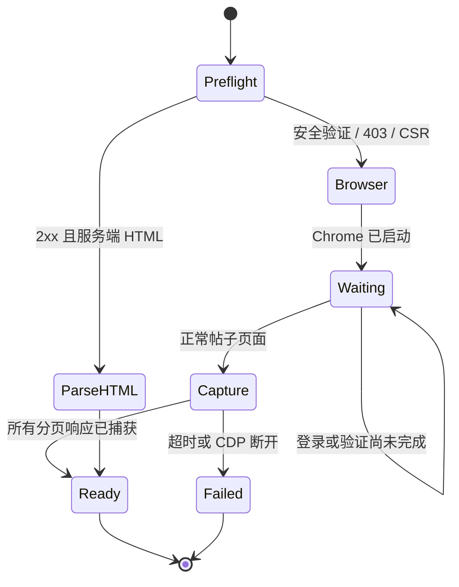
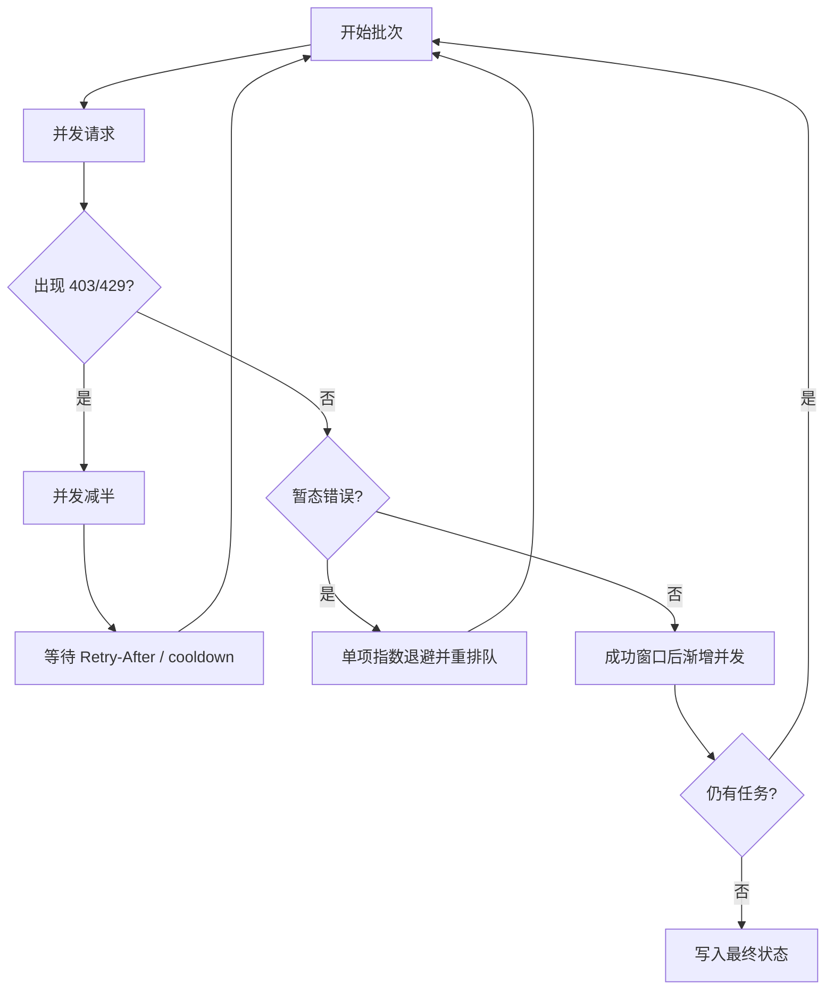

# 系统架构

[English](architecture.en.md) | 简体中文

## 目标与约束

系统需要在贴吧 HTML 结构和风控响应随时变化的前提下，完整提取正文原图，同时控制请求压力、保护登录凭据，并允许大批量任务在网络中断后恢复。因此架构分为“访问与认证”“内容发现”“计划生成”“可靠下载”四个阶段，每个阶段通过明确的数据结构交接。

## 总体架构

这种双解析路径保留了对旧页面的兼容性，又不依赖虚拟列表 DOM。客户端页面只渲染当前视口，直接滚动 DOM 容易漏图；捕获浏览器已经成功发出的 `page_pc` 响应可以获得完整分页数据，同时无需复制或逆向请求签名。

## 运行时序

## 认证状态机

Chrome 使用应用专属 profile 和随机本地调试端口。程序只选择 `baidu.com` 域 Cookie，不接触用户日常浏览器的配置文件。CDP 连接仅监听 `127.0.0.1`，任务结束后关闭专用浏览器。

## 数据模型与边界

核心中间模型 `ImageRecord` 包含页码、帖子顺序、图片顺序、楼层、作者、帖子 ID、原始 URL、规范 URL 和目标文件名。解析器只负责产生记录；去重器只负责确定顺序与名称；下载器只消费记录。这样页面格式变化不会侵入续传逻辑，下载协议变化也不会影响解析器。

状态文件通过“写临时文件、刷新、重命名”原子更新。图片先写同目录 `.part`，完全接收后再重命名，避免崩溃后把半文件误认为成功结果。

## 并发与错误控制

页面扫描与图片下载有独立上限。下载从较小并发开始，成功窗口逐步增加；HTTP 403/429 会使有效并发减半，并遵守 `Retry-After` 或配置的冷却时间。DNS、连接中断等暂态错误按单项指数退避，不阻塞已经成功的文件。

## 安全边界

- 不求解验证码、不构造绕过请求、不绕过访问权限。
- 不读取个人浏览器数据库；只操作应用专属 Chrome profile。
- Cookie 不写入日志、manifest、下载状态或失败清单。
- 下载仅接受成功状态和已识别的 `image/*` MIME。
- URL、Cookie 文件、并发值和 Range 响应均在使用前校验。
