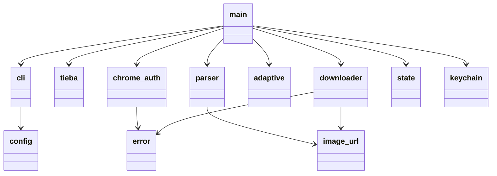
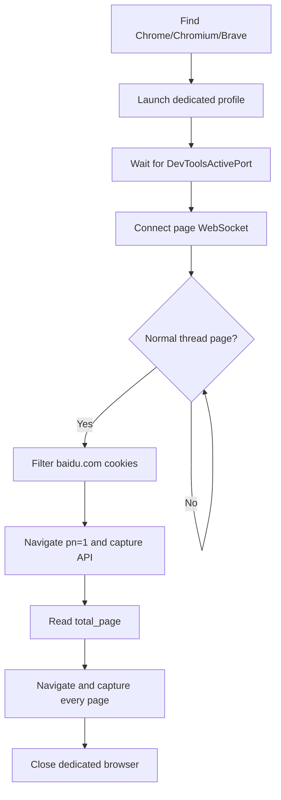
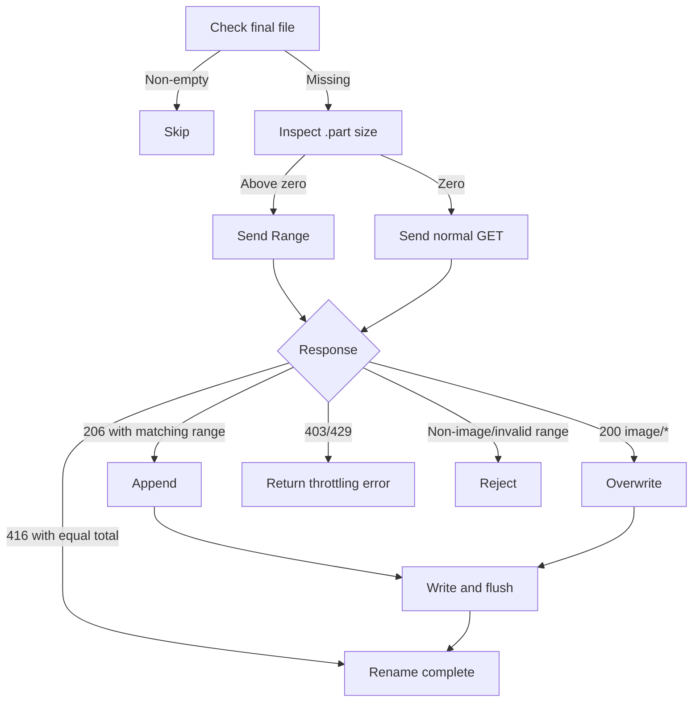

# Module Design

English | [简体中文](modules.md)

## Dependency Map

Modules are separated by reason to change: CLI options, Tieba page protocols, Chrome/CDP, and HTTP transfer evolve independently. `main.rs` is the sole orchestration layer; business modules never depend back on the CLI.

## `main.rs`: Orchestration

Collects configuration, creates the HTTP client, performs preflight, selects the HTML or Chrome path, writes the manifest, schedules batches, and reports results. It deliberately excludes selectors, CDP frame parsing, and Range file writes.

The primary path is `collect -> fetch_page -> login/scan_pages -> sort_deduplicate -> download_all`. A cancellation token flows into scanning and downloading so Ctrl+C converges safely at batch boundaries.

## `cli.rs` and `config.rs`: Input Boundary

`cli.rs` provides both Clap arguments and a Dialoguer wizard. It validates image concurrency in `1..=256` and page concurrency in `1..=64` before core execution. `config.rs` is the UI-independent runtime configuration, keeping downstream modules independent from argument parsing.

## `tieba.rs`: Thread Addressing

Uses a structured URL parser to extract the numeric thread ID and generate canonical page URLs. Non-HTTP(S), non-Tieba hosts, and paths outside `/p/<id>` are rejected to prevent target drift through string concatenation.

## `chrome_auth.rs`: Isolated Browser Adapter

Discovers a browser, launches a dedicated profile, reads the random debugging port, exchanges WebSocket CDP commands, detects page state, filters Baidu cookies, and captures `page_pc` requests and responses.

Capturing browser traffic instead of reproducing signatures lets Tieba's own page code maintain protocol details and avoids dependence on a virtualized DOM.

## `keychain.rs` and `cookie.rs`: Credential Inputs

`keychain.rs` stores, loads, and clears a session through macOS Security Framework under an application service name. `cookie.rs` is an optional compatibility path for raw Cookie headers and Netscape files, retaining only valid Baidu domain/path/expiry entries. Credentials enter request-header memory only, never persisted task data.

## `parser.rs`: Unified Image Records

The legacy HTML path scopes selection to floors and body containers, falling back through `data-original`, original-image links, `data-src`, and `src`. The API path reads `first_floor` and `post_list`, accepts only `content.type == 3`, and falls back through `origin_src`, `big_cdn_src`, `cdn_src_active`, and `cdn_src`. Both produce `ImageRecord` values.

Records are stably sorted by `(page, post_order, image_order)`, deduplicated by normalized URL with first occurrence retained, and named from sequence, floor, and a short BLAKE3 URL hash. Determinism makes repeated and resumed runs address the same files.

## `image_url.rs`: URL Normalization

Handles protocol-relative URLs, conservative original-image path conversion, extensions, and MIME mappings. Only known Tieba thumbnail forms are transformed; signed parameters are not arbitrarily removed.

## `adaptive.rs`: Concurrency Controller

A pure state component mapping current concurrency, limit, and batch outcome to the next concurrency. It grows gradually after success, halves quickly after throttling, and remains within `1..=limit`. The pure boundary is easy to test and independent of the HTTP client.

## `downloader.rs`: Reliable Transfer

The downloader consumes a byte stream rather than buffering a full image. `.part` and final files share a directory, so rename is normally atomic within one filesystem.

## `state.rs`: Task Persistence

Stores `pending/running/completed/failed`, byte count, error, and timestamp for each target. JSON is written to a same-directory temporary file, flushed, and renamed to reduce the chance of a truncated state file after power loss.

## `error.rs`: Error Semantics

`AppError` unifies IO, HTTP, JSON, URL, verification, throttling, non-image, and invalid-Range failures. Classification methods decide browser fallback, concurrency reduction, and retry behavior without string-driven control flow.

## Test Boundaries

Parsers use fixed fixtures; the downloader uses local mock HTTP to verify 200/206/416/429 precisely; concurrency, URL, cookie, Chrome cookie filtering, and atomic state have focused unit tests. Real-thread testing detects external protocol changes but does not replace deterministic automation.
