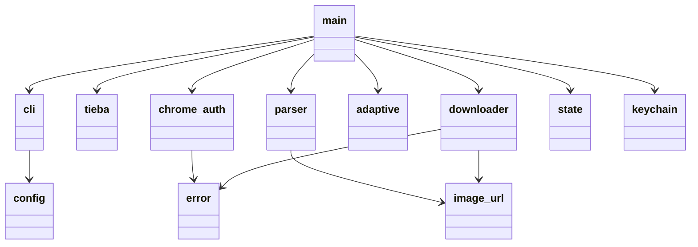
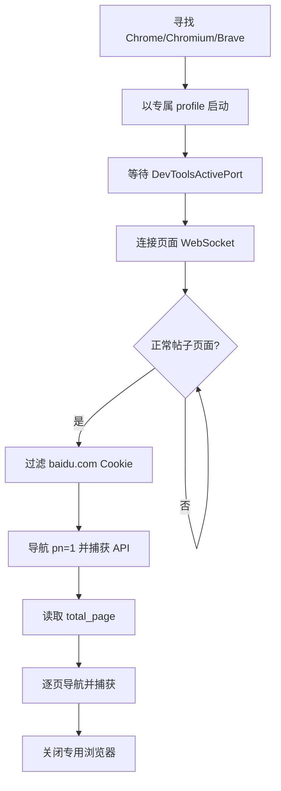
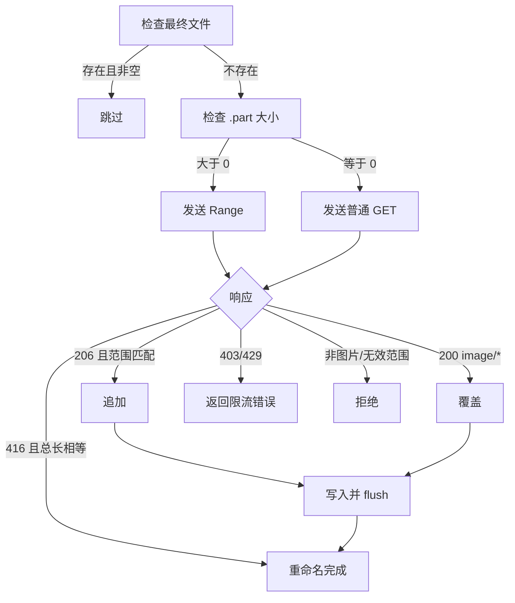

# 模块设计

[English](modules.en.md) | 简体中文

## 模块关系

模块按变化原因拆分：命令行参数、贴吧页面协议、Chrome/CDP 协议和 HTTP 下载协议彼此独立。`main.rs` 是唯一的流程编排层，业务模块不反向依赖 CLI。

## `main.rs`：任务编排

负责配置收集、HTTP 客户端创建、预检、选择 HTML/Chrome 路径、写 manifest、批次调度及最终报告。它不实现 HTML 选择器、CDP 帧解析或 Range 写入，以免入口文件成为不可测试的协议集合。

关键流程为：`collect -> fetch_page -> login/scan_pages -> sort_deduplicate -> download_all`。取消令牌从入口向扫描与下载传播，保证 Ctrl+C 在批次边界安全收敛。

## `cli.rs` 与 `config.rs`：输入边界

`cli.rs` 同时提供 Clap 非交互参数和 Dialoguer 交互向导，并在进入核心流程前限制图片并发 `1..=256`、页面并发 `1..=64`。`config.rs` 是无 UI 的运行配置，避免后续模块依赖参数解析框架。

## `tieba.rs`：帖子地址

使用结构化 URL parser 提取数字帖子 ID，并统一生成分页 URL。拒绝非 HTTP(S)、非贴吧域名和不符合 `/p/<id>` 的输入，避免字符串拼接导致目标漂移。

## `chrome_auth.rs`：隔离浏览器适配器

职责包括浏览器发现、专属 profile 启动、读取随机调试端口、WebSocket CDP 命令、页面状态检测、百度域 Cookie 过滤，以及 `page_pc` 请求/响应捕获。

选择“捕获浏览器请求”而非在 Rust 中复刻签名，是为了让百度自己的页面代码维护协议细节，同时避免依赖虚拟 DOM。

## `keychain.rs` 与 `cookie.rs`：凭据输入

`keychain.rs` 在 macOS Security Framework 中以应用服务名保存、加载、清除会话。`cookie.rs` 是可选兼容入口，解析原始请求头和 Netscape 文件，只保留域、路径和有效期合规的百度条目。凭据只进入 HTTP Header 内存，不进入持久化任务数据。

## `parser.rs`：统一图片记录

旧 HTML 路径限定楼层和正文容器，按 `data-original`、原图链接、`data-src`、`src` 回退。API 路径处理 `first_floor` 和 `post_list`，只接受 `content.type == 3`，按 `origin_src`、`big_cdn_src`、`cdn_src_active`、`cdn_src` 回退。两条路径都输出 `ImageRecord`。

随后按 `(page, post_order, image_order)` 稳定排序，以规范 URL 保留首次出现项，并用序号、楼层、BLAKE3 URL 短哈希生成确定性名称。确定性让重复执行和断点恢复指向同一文件。

## `image_url.rs`：URL 规范化

负责协议相对地址、原图路径的保守转换、扩展名和 MIME 映射。只转换已知的贴吧缩略图形式，不任意删除签名参数，避免生成无法访问的“猜测原图”。

## `adaptive.rs`：并发控制器

这是一个纯状态模块，输入当前并发、上限和批次结果，输出下一并发。成功时渐增，受限时快速减半，始终保持在 `1..=上限`。纯函数式边界便于测试且不耦合网络库。

## `downloader.rs`：可靠文件传输

下载器不把整个图片载入内存，而是消费字节流。`.part` 与最终文件位于同一目录，重命名通常是同文件系统原子操作。

## `state.rs`：任务持久化

保存每个目标文件的 `pending/running/completed/failed` 状态、字节数、错误和更新时间。JSON 先写同目录临时文件，刷新后重命名，减少断电时留下截断 JSON 的概率。

## `error.rs`：错误语义

`AppError` 统一 IO、HTTP、JSON、URL、验证、限流、非图片和无效 Range。分类方法决定是否打开浏览器、是否降低并发和是否重试，避免通过错误字符串驱动控制流。

## 测试边界

解析器使用固定 fixture；下载器使用本地 mock HTTP 精确验证 200/206/416/429；并发、URL、Cookie、Chrome Cookie 过滤和原子状态各自有单元测试。真实帖子测试用于发现外部协议变化，不替代确定性自动化测试。
