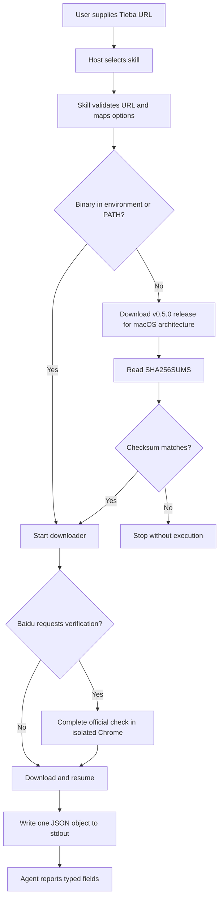

# Plugin Design and Usage

English | [简体中文](plugin.md)

## Goal

The plugin exposes the CLI as a discoverable `download-tieba-images` skill for ChatGPT/Codex and Claude Code. A user supplies a post URL and intent in chat; the agent translates flags, installs the binary, runs it, and reports the outcome. If Baidu requires login or security verification, the application only opens an isolated official Chrome page. It never reads the personal browser profile or asks the user to copy cookies.

## Layout and Compatibility

```text
.agents/plugins/marketplace.json                 Codex/ChatGPT catalog
.claude-plugin/marketplace.json                  Claude Code marketplace
plugins/tieba-image-downloader/
  .codex-plugin/plugin.json                      Codex metadata
  .claude-plugin/plugin.json                     Claude Code metadata
  skills/download-tieba-images/
    SKILL.md                                     shared Agent Skills instructions
    agents/openai.yaml                           ChatGPT/Codex UI metadata
    scripts/run.sh                               bootstrap, verify, and execute
```

Both hosts use the same skill and script. Only marketplace and plugin metadata differ, keeping behavior, security boundaries, and versions aligned.

## Installation

Claude Code can add the GitHub marketplace directly:

```text
/plugin marketplace add XieWeikai/tieba-image-downloader
/plugin install tieba-image-downloader@tieba-tools
```

Non-interactive equivalents:

```bash
claude plugin marketplace add XieWeikai/tieba-image-downloader
claude plugin install tieba-image-downloader@tieba-tools
```

In ChatGPT/Codex clients that support repository or local marketplaces, add `.agents/plugins/marketplace.json` from the repository root and install `tieba-image-downloader`. For development, load the checkout as a local marketplace; the exact entry point is exposed by the current Codex plugin UI or `codex plugin` command.

## Chat Usage

Natural-language requests automatically select the skill:

```text
Download every original image from https://tieba.baidu.com/p/10918721568
Save only the original author's images to ~/Downloads/example
```

Claude Code also supports explicit invocation:

```text
/tieba-image-downloader:download-tieba-images https://tieba.baidu.com/p/10918721568
```

## Runtime Flow



`run.sh` checks `TIEBA_IMAGE_DOWNLOADER_BIN`, then `PATH`, and only reuses a binary whose version is exactly v0.5.0. Otherwise, it installs the matching release in a versioned user cache. Before execution, the archive's SHA-256 digest must match the release manifest.

The script always appends `--output-format json`. Human progress and browser instructions go to stderr; successful stdout contains one JSON object. The skill parses `post_id`, `output_dir`, `discovered`, `completed`, `skipped`, `failed`, and `browser_verification_used` by field instead of depending on terminal wording.

## Versioning and Release

The Rust crate, Cargo lockfile, marketplace manifest, both plugin manifests, and bootstrap script share one semantic version. CI compares them with `scripts/check-version-sync.sh`; the Release workflow also requires the `vX.Y.Z` tag to match before it builds both macOS architectures, generates checksums, and publishes assets.

## Security Boundary

- The skill accepts only canonical `tieba.baidu.com/p/<digits>` post URLs.
- It does not solve CAPTCHAs, forge verification, or bypass access controls.
- It never asks for cookies, passwords, or developer-tools data.
- It never executes an archive that fails checksum verification.
- Downloaded content remains untrusted and is never executed by the skill.
