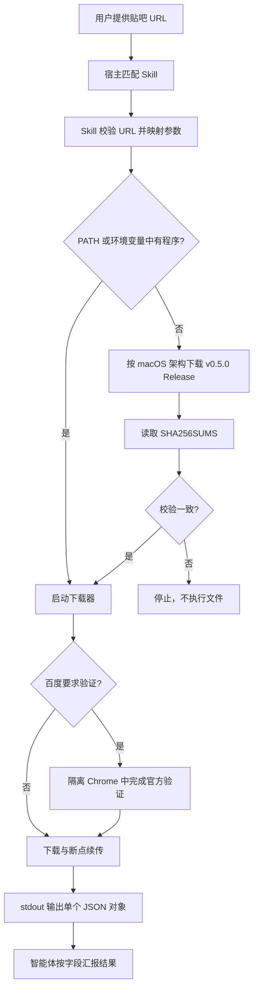

# 插件设计与使用

[English](plugin.en.md) | 简体中文

## 目标

插件把命令行工具包装成可被 ChatGPT/Codex 和 Claude Code 自动发现的 `download-tieba-images` Skill。用户只需在对话中给出帖子 URL 和下载要求；智能体负责参数转换、安装、执行和结果汇报。百度要求登录或安全验证时，程序仍只打开隔离的官方 Chrome 页面，不读取个人浏览器配置，也不要求复制 Cookie。

## 目录与兼容层

```text
.agents/plugins/marketplace.json                 Codex/ChatGPT 市场清单
.claude-plugin/marketplace.json                  Claude Code 市场清单
plugins/tieba-image-downloader/
  .codex-plugin/plugin.json                      Codex 插件元数据
  .claude-plugin/plugin.json                     Claude Code 插件元数据
  skills/download-tieba-images/
    SKILL.md                                     共享的 Agent Skills 指令
    agents/openai.yaml                           ChatGPT/Codex 展示信息
    scripts/run.sh                               自动安装、校验与执行
```

两种宿主共用同一个 Skill 和执行脚本。宿主差异只存在于市场清单与插件元数据，因此下载逻辑、权限边界和版本始终一致。

## 安装

Claude Code 支持直接添加 GitHub 市场：

```text
/plugin marketplace add XieWeikai/tieba-image-downloader
/plugin install tieba-image-downloader@tieba-tools
```

也可用非交互命令：

```bash
claude plugin marketplace add XieWeikai/tieba-image-downloader
claude plugin install tieba-image-downloader@tieba-tools
```

在支持本地/仓库市场的 ChatGPT/Codex 中，添加仓库根目录的 `.agents/plugins/marketplace.json`，选择 `tieba-image-downloader` 安装。开发时可直接把仓库作为本地市场载入；实际入口由当前 Codex 客户端的插件管理界面或 `codex plugin` 命令提供。

## 对话使用

自然语言会自动触发 Skill：

```text
下载 https://tieba.baidu.com/p/10918721568 的全部原图
把这个帖子只看楼主的图片保存到 ~/Downloads/example
```

Claude Code 也可显式调用：

```text
/tieba-image-downloader:download-tieba-images https://tieba.baidu.com/p/10918721568
```

## 运行原理



`run.sh` 优先检查 `TIEBA_IMAGE_DOWNLOADER_BIN`，其次检查 `PATH`；只有版本恰好为 v0.5.0 才会复用，否则安装对应 Release。缓存按插件版本隔离，升级不会覆盖旧版本。Release 文件先计算 SHA-256 并与同一 Release 的清单比对，失败时立即终止。

脚本始终追加 `--output-format json`。下载器把人类进度和浏览器提示写入 stderr，成功时 stdout 只有一个 JSON 对象。Skill 按字段解析 `post_id`、`output_dir`、`discovered`、`completed`、`skipped`、`failed` 和 `browser_verification_used`，不再依赖中文终端文案。

## 版本与发布

Rust crate、Cargo lockfile、市场清单、两个插件清单和引导脚本使用同一语义版本。`scripts/check-version-sync.sh` 在 CI 中逐项比较；Release Workflow 还会确认 `vX.Y.Z` 标签与版本一致，然后才构建两种 macOS 架构、生成校验和并发布资产。

## 安全边界

- Skill 仅接受规范的 `tieba.baidu.com/p/<数字>` 帖子地址。
- 不求解验证码、不伪造验证结果、不绕过访问控制。
- 不索取 Cookie、密码或开发者工具内容。
- Release 校验失败时绝不执行下载文件。
- 下载产物按不可信文件处理，Skill 不执行图片或附件。
