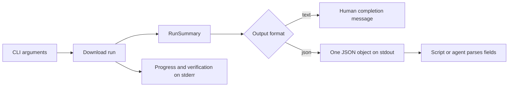

# Structured Output

English | [简体中文](structured-output.md)

## Goal

`--output-format json` is the stable interface shared by the CLI, automation, and agent plugin. Terminal wording can evolve independently while callers depend on a typed final result. On success, stdout contains exactly one JSON object; progress bars, browser instructions, and diagnostics are written to stderr.



## Usage

```bash
tieba-image-downloader URL --output-format json
tieba-image-downloader URL --metadata-only --output-format json
```

`--metadata-only` parses pages, deduplicates records, assigns deterministic names, and writes `manifest.json` without creating download tasks or requesting image bodies. It is intended for compatibility checks and automation that reviews a manifest first.

## Success Result

```json
{
  "post_id": "10918721568",
  "output_dir": "/Users/example/Downloads/tieba_10918721568",
  "discovered": 216,
  "completed": 214,
  "skipped": 2,
  "failed": 0,
  "browser_verification_used": true
}
```

| Field | Type | Meaning |
| --- | --- | --- |
| `post_id` | string | Decimal ID extracted from the canonical post URL |
| `output_dir` | string | Absolute directory containing this run's state and files |
| `discovered` | integer | Deduplicated number of body-image originals |
| `completed` | integer | Images downloaded during this run |
| `skipped` | integer | Existing valid files skipped during this run |
| `failed` | integer | Images still failed after retries |
| `browser_verification_used` | boolean | Whether the isolated browser handled an official verification during this run |

In metadata-only mode, `completed`, `skipped`, and `failed` are zero while `discovered` still describes the full manifest. Fields may be added compatibly; existing fields will not be renamed or change type in a patch release.

## Process Semantics

A successful process exits with code 0 and stdout can be passed directly to a JSON parser. A failure exits nonzero and writes a concise error to stderr without fabricating a success object. Callers must check both the exit code and JSON structure, never extract counts from progress text with regular expressions.
