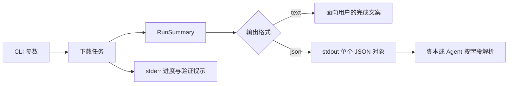

# 结构化输出

[English](structured-output.en.md) | 简体中文

## 目标

`--output-format json` 是 CLI、自动化和 Agent 插件共享的稳定接口。终端文案可以独立改进，而调用方只依赖带类型的最终结果。成功运行时 stdout 严格只包含一个 JSON 对象；进度条、浏览器验证说明和诊断信息全部写入 stderr。



## 使用

```bash
tieba-image-downloader URL --output-format json
tieba-image-downloader URL --metadata-only --output-format json
```

`--metadata-only` 完成页面解析、去重、确定性命名并写入 `manifest.json`，但不创建下载任务或请求图片。它主要用于兼容性检查和需要先审查清单的自动化。

## 成功结果

```json
{
  "post_id": "10918721568",
  "output_dir": "/Users/example/Downloads/tieba_10918721568",
  "discovered": 216,
  "completed": 214,
  "skipped": 2,
  "failed": 0,
  "browser_verification_used": true
}
```

| 字段 | 类型 | 语义 |
| --- | --- | --- |
| `post_id` | string | 从规范帖子 URL 提取的十进制 ID |
| `output_dir` | string | 本次状态和文件所在的绝对目录 |
| `discovered` | integer | 去重后的正文原图总数 |
| `completed` | integer | 本轮实际完成下载的数量 |
| `skipped` | integer | 已存在有效文件而跳过的数量 |
| `failed` | integer | 重试后仍失败的数量 |
| `browser_verification_used` | boolean | 本轮是否启动隔离浏览器完成官方验证 |

元数据模式中 `completed`、`skipped` 和 `failed` 均为零，`discovered` 仍表示完整清单数量。字段只做向后兼容的增加；现有字段不会在补丁版本中改名或改变类型。

## 进程语义

成功时退出码为 0，stdout 可直接交给 JSON parser。失败时退出码非零，简明错误写入 stderr，不输出伪造的成功对象。调用方必须同时检查退出码和 JSON 结构，不能从进度文字中用正则提取统计值。
