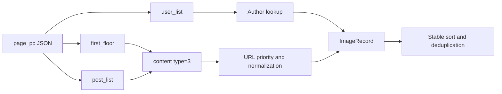

# Tieba Page Structure and Parsing Basis

English | [简体中文](tieba-page-structure.md)

## Research Status

On 2026-08-09, the public thread `https://tieba.baidu.com/p/10918721568` was tested. A sessionless preflight returned a security challenge. After official verification in the isolated Chrome session, the page was a Vue client-rendered application whose body data came from `POST /c/f/pb/page_pc`. The full-thread test returned 11 pages and 216 deduplicated body images.

When a challenge or empty CSR shell is detected, the application launches isolated Chrome and waits through CDP until the official page reaches a normal thread state. It captures API responses already issued by the browser; it neither constructs/reverses request signatures nor handles CAPTCHAs automatically.

## Implemented Contracts

- Parse `http/https`, scheme-less input, and `/p/<numeric ID>` with a URL parser; ignore user-provided pagination state.
- Generate canonical `/p/<id>?pn=N` URLs and request author-only mode when selected.
- For legacy HTML, derive page count from known pager nodes and numeric `pn` values.
- Restrict legacy image selection to post and body containers, excluding avatars and decoration.
- Read author, post ID, and floor metadata from structured `data-field` JSON with a `data-pid` fallback.
- Legacy image priority: `data-original`, original-image link, `data-src`, then `src`; emoticons are excluded.
- Convert protocol-relative URLs to HTTPS and conservatively transform known `/forum/w=580/` thumbnail paths.
- Require successful image responses with a recognized `image/*` MIME type; HTML, JSON, challenge pages, and empty bodies are rejected.
- Stably order by `(page, post order, image order)`, then deduplicate by normalized URL while keeping the first occurrence.
- For the current API, parse `first_floor` and `post_list[].content`, accept only `type=3`, and use URL priority `origin_src`, `big_cdn_src`, `cdn_src_active`, then `cdn_src`. Authors are joined from `user_list`.

## Data Flow

## Remaining Validation

More thread types should be used to continuously validate author-only behavior, folded/deleted replies, video mixtures, very long pagination, and CDN Range variations.
