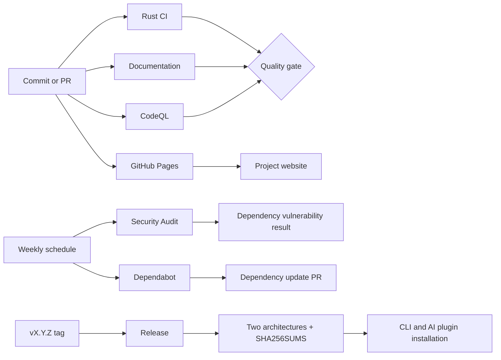
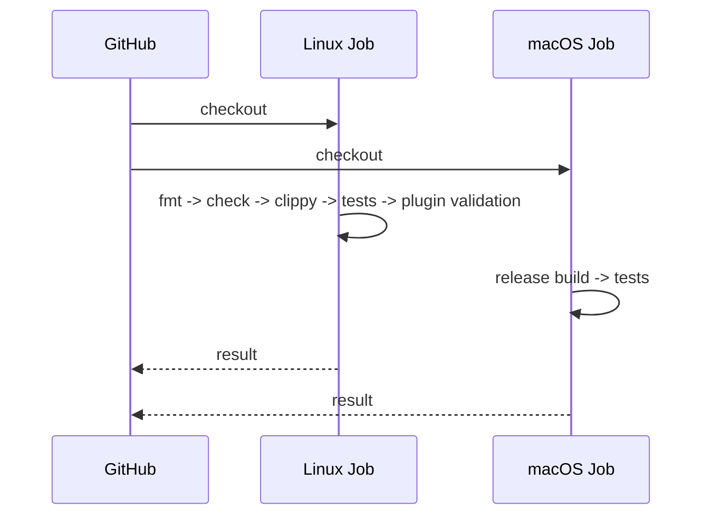

# GitHub Workflows Design

English | [简体中文](workflows.md)

## Goals

Automation is split into five responsibility lines: fast feedback, continuous security, documentation quality, dependency maintenance, and reproducible releases. Each workflow uses minimum permissions and one clear responsibility so failures remain diagnosable and slow jobs do not obscure other checks.

## Inventory

| File | Triggers | Responsibility | Permission and reason |
| --- | --- | --- | --- |
| `ci.yml` | `main` push, PR, manual | Format, compile, Clippy, tests, macOS build, plugin JSON/Shell validation | `contents: read`; source only |
| `docs.yml` | `main` push, PR, manual | Markdownlint and link checking | `contents: read` |
| `codeql.yml` | push, PR, weekly, manual | Rust static security analysis | `security-events: write` to upload SARIF; runs for public repositories |
| `audit.yml` | `Cargo.lock` changes, weekly, manual | Known-vulnerability checks with `cargo audit` | Reuses maintained workflow; `contents: read` |
| `release.yml` | `vX.Y.Z` tag, manual | Test, two-architecture build, package, checksum, GitHub Release | `contents: write` only for release assets |
| `pages.yml` | `website/` or workflow changes, manual | Package the static website and deploy it to GitHub Pages | `pages: write` and `id-token: write`, scoped to Pages deployment |
| `dependabot.yml` | weekly | Cargo and GitHub Actions dependency updates | Separate PRs allow review and rollback |

## Rust CI

The Linux job provides fast compilation and static feedback. The macOS job covers platform conditions required by Keychain and Chrome integration. Plugin validation belongs in Linux because JSON and POSIX shell syntax are platform-independent. `--locked` makes CI use the committed dependency graph.

Recommended required checks for `main` are both Rust CI jobs, Documentation, and CodeQL, with changes merged through pull requests. A small personal repository can retain an administrator bypass for repairing the workflow definitions themselves.

## Security Automation

CodeQL finds dangerous source-level data flows. Its Rust extractor uses the required `build-mode: none` to analyze source directly, while Rust CI independently guarantees compilation. `cargo audit` compares locked dependencies against RustSec advisories. They are complementary. Dependabot proposes updates but does not auto-merge them: networking, parsing, browser-protocol, and Keychain changes should pass review and tests first.

Workflows are read-only by default. Only CodeQL receives `security-events: write`, and Release receives `contents: write`. No custom secret is required; publishing uses GitHub's short-lived, scoped `GITHUB_TOKEN`.

## Release Flow

1. Update the version in `Cargo.toml`, `Cargo.lock`, both plugin manifests, and `run.sh`.
2. Run all quality checks locally and merge into `main`.
3. Create and push a `vX.Y.Z` tag.
4. The Release workflow tests and builds on Apple Silicon and Intel runners.
5. Each runner uploads a `.tar.gz`; the publish job generates `SHA256SUMS`.
6. The job creates a GitHub Release, uploads assets, and publishes the draft.
7. The AI plugin can then bootstrap that version and rejects any checksum mismatch.

Tags are the only release entry point, preventing ordinary commits from publishing artifacts accidentally. Architectures build independently, and an incomplete matrix cannot publish a release.

## Website Deployment

The project website is a dependency-free static site under `website/`. `pages.yml` runs only when website files change and uses GitHub's official Pages actions to upload and deploy the artifact. The production URL is `https://xieweikai.github.io/tieba-image-downloader/`; it is also recorded in both READMEs and the repository Website field. The site uses no custom secret, executes no repository code, and never uploads `target/` or other development artifacts.

## Maintenance and Failures

- CI failure: run the identically named commands locally; do not hide deterministic failures by rerunning.
- Documentation failure: repair Markdown or links. Ignore a flaky external site only with a documented reason.
- CodeQL alert: inspect path and reachability in Security, then let a new analysis close the repaired alert.
- Audit failure: evaluate the RustSec advisory, upgrade, or record a time-limited risk acceptance; avoid permanent ignores.
- Release failure: rerun the same tag after repairing infrastructure. Do not move a published tag; use a patch version when code changes.

## Cost and Concurrency

CI concurrency cancellation lets a new commit replace an obsolete run on the same branch or PR. Weekly security and dependency schedules are frequent enough without excessive runner usage. Release runs only for tags; the two-architecture cost is justified by users avoiding local compilation.
