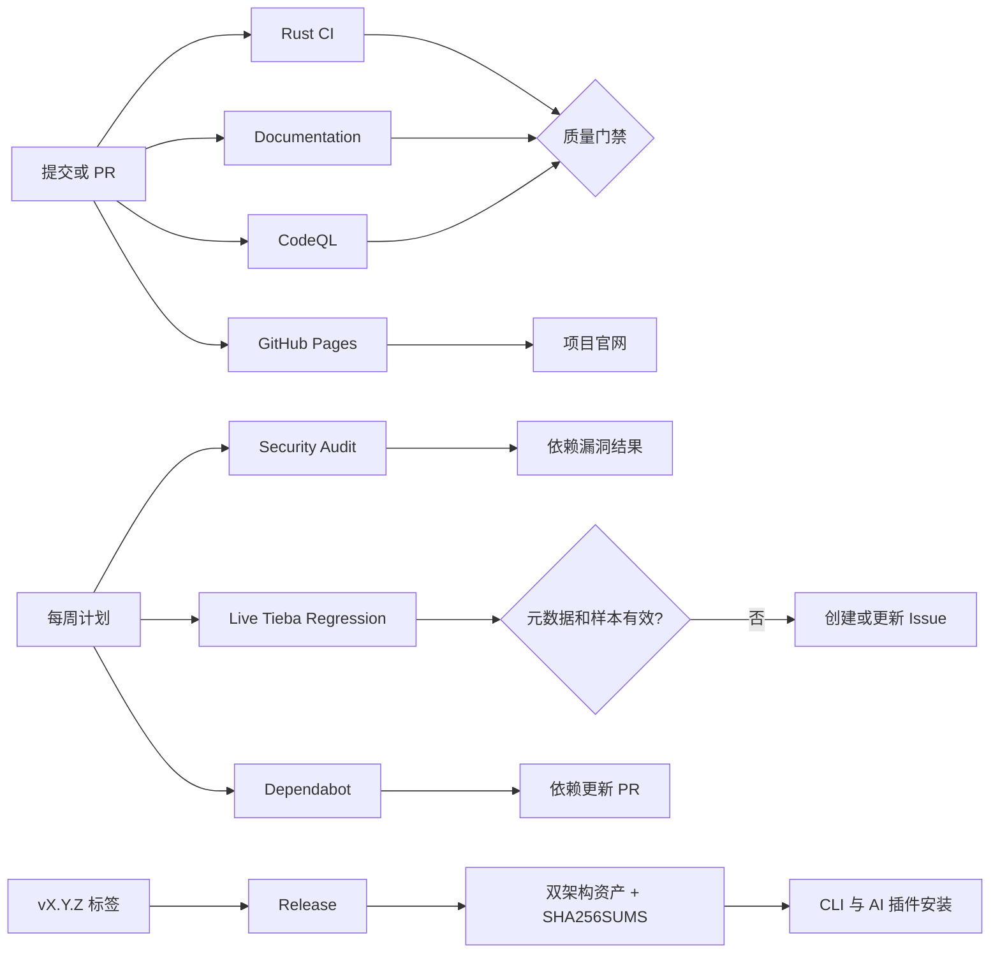
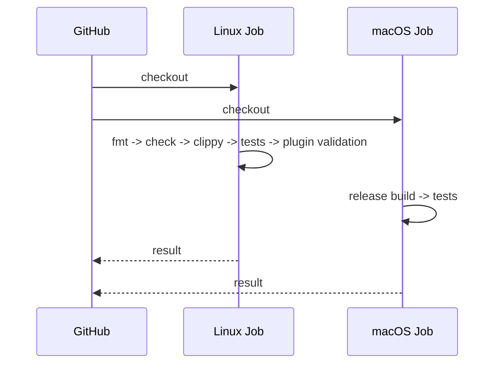
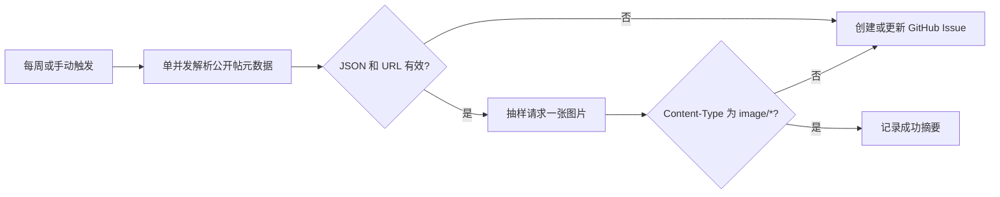

# GitHub Workflows 设计

[English](workflows.en.md) | 简体中文

## 目标

自动化分为“快速反馈、持续安全、文档质量、依赖维护、可重复发布”五条责任线。每个 Workflow 使用最小权限并保持单一职责，使失败原因清晰，也避免一次慢任务阻塞全部检查。

## 工作流清单

| 文件 | 触发条件 | 主要工作 | 权限与原因 |
| --- | --- | --- | --- |
| `ci.yml` | `main` push、PR、手动 | 格式、编译、Clippy、测试、macOS 构建、插件 JSON/Shell 校验 | `contents: read`，只读源码 |
| `docs.yml` | `main` push、PR、手动 | Markdownlint 与链接检查 | `contents: read` |
| `codeql.yml` | push、PR、每周、手动 | Rust 静态安全分析 | `security-events: write`，上传 SARIF；公开仓库运行 |
| `audit.yml` | `Cargo.lock` 变更、每周、手动 | `cargo audit` 检查已知漏洞 | 复用维护方 Workflow，`contents: read` |
| `release.yml` | `vX.Y.Z` 标签、手动 | 测试、双架构构建、打包、校验和、GitHub Release | `contents: write`，仅用于发布资产 |
| `pages.yml` | `website/` 或 Workflow 变更、手动 | 打包静态官网并部署到 GitHub Pages | `pages: write` 与 `id-token: write`，仅用于 Pages 部署 |
| `live-regression.yml` | 每周、手动 | 公开测试帖元数据解析与一张限量图片抽样 | `issues: write`，失败时创建或更新兼容性 Issue |
| `dependabot.yml` | 每周计划 | 更新 Cargo 与 GitHub Actions 依赖 | 创建独立 PR，便于审阅和回滚 |

## Rust CI

Linux Job 提供最快的编译和静态检查反馈；macOS Job 覆盖钥匙串和 Chrome 集成所依赖的平台条件。插件校验放在 Linux Job，因为 JSON 与 POSIX Shell 语法不依赖 macOS。`--locked` 保证 CI 使用提交的 `Cargo.lock`，避免同一提交随时间产生不同依赖图。

建议把 `Rust CI / Format, Clippy, and tests`、`Rust CI / macOS build and tests`、Documentation 与 CodeQL 设置为 `main` 的必需检查，并要求 PR 合并。小型个人仓库也应保留管理员绕过能力，以便修复 Workflow 自身。

## 安全自动化

CodeQL 分析源码中的危险数据流；Rust 提取器使用其要求的 `build-mode: none` 直接分析源码，编译正确性由 Rust CI 独立保证。`cargo audit` 对照 RustSec 数据库检查锁定依赖。两者互补，不能互相替代。Dependabot 只提出更新，不自动合并：网络、解析器、浏览器协议和钥匙串依赖都应先经过测试。

所有 Workflow 默认只读。只有 CodeQL 获得 `security-events: write`，Release 获得 `contents: write`。仓库不需要自定义 Secret；发布使用 GitHub 自动提供、作用域受限的 `GITHUB_TOKEN`。

## 发布流程

1. 更新 `Cargo.toml`、`Cargo.lock`、市场清单、两个插件清单和 `run.sh` 中的版本。
2. 本地运行全部质量检查并合并到 `main`。
3. 运行 `scripts/check-version-sync.sh`，再创建并推送 `vX.Y.Z` 标签。
4. Release Workflow 确认标签和所有版本字段一致，再在 Apple Silicon 和 Intel runner 上分别测试和构建。
5. 每个 runner 上传 `.tar.gz`；发布 Job 生成 `SHA256SUMS`。
6. 创建 GitHub Release、上传资产并解除草稿状态。
7. AI 插件随后才能自动下载该版本；校验和不一致会拒绝执行。

发布采用标签作为唯一入口，避免普通提交意外产生公开制品。两个架构独立构建，任一失败都不会发布不完整 Release。

## 真实兼容性回归

`live-regression.yml` 每周六在临时 macOS runner 上读取公开测试帖 `10918721568`。它以单页面并发运行 `--metadata-only --output-format json`，必要时允许全新隔离 Chrome 执行贴吧自己的客户端渲染，但禁用会话保存。随后验证结构化结果及全部 manifest URL，只对第一张图片请求最多一个有界样本并检查 `Content-Type: image/*`。

该检查不求解验证码、不使用私人 Cookie，也不保存浏览器 profile、帖子或图片制品。若 GitHub 出口触发必须人工完成的验证，Workflow 将结果分类为“访问受阻”，写入运行摘要并更新一个长期 Issue，而不会尝试绕过或误报代码失败。只有在页面已可访问后出现 JSON、URL 或图片校验错误时才让 Workflow 失败。两类 Issue 都会复用，避免定时任务制造重复问题。它用于尽早发现外部页面协议漂移，不替代 fixture 和 mock HTTP 测试。

## 官网部署

官网是 `website/` 中的无构建依赖静态站点。`pages.yml` 仅在网站文件变化时运行，通过 GitHub 官方 Pages Actions 上传并部署制品。生产地址固定为 `https://xieweikai.github.io/tieba-image-downloader/`，同时记录在 README 和仓库 Website 字段中。网站不使用自定义 Secret，不执行仓库代码，也不把 `target/` 或其他开发产物上传到 Pages。

## 维护与故障处理

- CI 失败：先在本地运行 Workflow 中同名命令，不通过时不要重跑掩盖确定性错误。
- 文档失败：修复 Markdown 结构或失效链接；外部站点偶发失败应明确加入忽略清单并说明原因。
- CodeQL 发现问题：在 Security 页面确认路径和可达性，修复后由新分析关闭告警。
- Audit 失败：确认 RustSec 公告影响范围，升级或记录有期限的风险接受，不永久忽略。
- Release 失败：修复后重新运行同一标签的 Workflow；不要移动已公开标签。若代码必须改变，发布新补丁版本。

## 成本与并发

CI 使用并发取消策略时，新提交会取消同一 PR/分支上的旧运行，减少等待与额度浪费。定时任务设为每周，足以跟踪依赖风险而不过度消耗 runner。Release 只在标签出现时运行，双架构成本与用户无需本地编译的收益相匹配。
